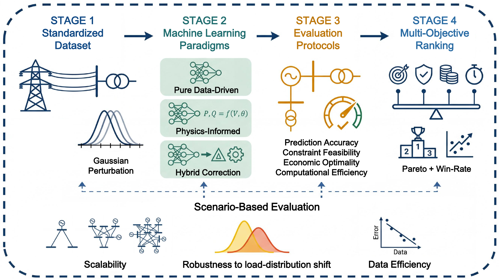

# ML-OPF-Bench

ML-OPF-Bench is a comprehensive benchmark for machine learning methods for AC and DC optimal power flow (OPF), bringing together OPF datasets and a broad collection of method implementations. Through systematic comparisons across power systems, training data sizes, and load distributions, it examines the trade-offs among prediction accuracy, constraint satisfaction, generation cost, and computational efficiency. These comparisons reveal insights into the strengths and limitations of existing approaches, offering guidance for the development and practical application of future learning-based OPF methods. The accompanying Python package supports reproducible evaluation and provides a common interface for integrating new methods.

[Dataset](https://huggingface.co/datasets/xinyi-liu/ML-OPF-Bench) · [Project page](https://xinyiliu04.github.io/ml-opf-bench-webpage/)



## Install

Requires Python 3.11 or later.

```bash
python -m pip install git+https://github.com/XinyiLiu04/ML-OPF-Bench.git
```

## Get the data

```bash
hf download xinyi-liu/ML-OPF-Bench --repo-type dataset --local-dir ./ML-OPF-Bench-data
export ML_OPF_BENCH_DATA="$PWD/ML-OPF-Bench-data"
```

## Run

```bash
ml-opf-bench methods --formulation dc
ml-opf-bench run --formulation ac --method DNN --case case30 --device cpu
```

```python
from ml_opf_bench import Experiment, load_dataset, run_experiment

data = load_dataset("./ML-OPF-Bench-data", "dc", "case30")
split = data.split(seed=42)

spec = Experiment("dc", "LR", case="case30", device="cpu")
run_experiment(spec, "./ML-OPF-Bench-data", "./runs")
```

Each run saves its configuration, checkpoint, split indices, and evaluation results
in a new directory under `runs/`.

## Add a method

Implement `fit(train, validation, *, seed)` and `predict(inputs)`, returning a
`Prediction`. Register the class with `register_method("dc", "MY-METHOD", MyMethod)`
and pass its name to `Experiment`.

See [the minimal example](examples/custom_method.py) and [the interface](src/ml_opf_bench/methods.py).
Importable methods also work with `--plugin my_method:MyMethod --method MY-METHOD`.
